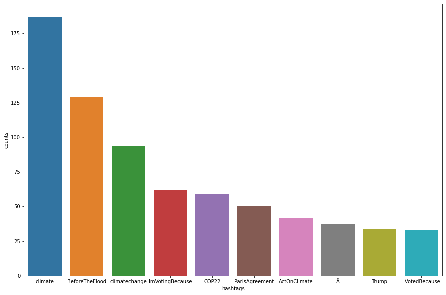

# Team_JM1_Climate-Change-Belief-Analysis-2022
Climate Change Belief Analysis 2022
### Project Summary
This project was done to solve the problem of market targeting with the aid of an app to accurately predict the market sentiments towards climate change. The hypothesis is that markets that believe in climate change have higher tendencies to patronize environmentally products.
- Collected, cleaned and identified potential errors in the dataset
- Carried out in-depth analysis on the dataset for better understanding and insight 
- Engineered some features/Coulmns in the dataset 
- Built 5 models( Logistic Regression, Passive Aggressive Classifier, Support vector Machine, RandomForest and MultiNomial Naive Bayes) that is capable of classifying tweets based on their sentiments 
- Selected Passive Aggressive Classifier and Random Forest model as the best two models based on their F1-score of 0.91 
- Optimised the model to tweaking the hyperparameter for the top two models
- Deployed the model using Streamlit for easy access

## BackGround Story 
Many companies are built around lessening one’s environmental impact or carbon footprint. They offer products and services that are environmentally friendly and sustainable, in line with their values and ideals. They would like to determine how people perceive climate change and whether or not they believe it is a real threat. This would add to their market research efforts in gauging how their product/service may be received. 

### Objective
TEAM JM1 Consultancy has been tasked with creation of a Sentiment Analysis model that will be able to classify whether or not a person believes in climate change, based on their novel tweet data.
### Brief description of the data
The dataset aggregates tweets pertaining to climate change collected between Apr 27, 2015 and Feb 21, 2018. In total, 43943 tweets were collected. Each tweet is labelled as one of the following classes: \
Class Description 
- 2 News: the tweet links to factual news about climate change

- 1 Pro: the tweet supports the belief of man-made climate change

- 0 Neutral: the tweet neither supports nor refutes the belief of man-made climate change

- -1 Anti: the tweet does not believe in man-made climate change \

Variable definitions

- sentiment: Sentiment of tweet

- message: Tweet body

- tweetid: Twitter unique id

### Exploratory Data Analysis
 \
Interpretation \
The above plot comfirms that: 
- 1296 tweets do not believe in man-made climate change -1

- 2353 tweets neither supports nor refutes the belief of man-made climate change 0

- 8530 Pro: the tweet supports the belief of man-made climate change 1

- 3640 News: the tweet links to factual news about climate change 2
 Inclusion , The highest proportion of the tweets supports the belief of man-made climate change

 

 

Key Insights from EDA
- The tweets contain punctuation marks and web urls.
- The tweet text is in mixed case version i.e. both lower and uppercase.
- The dataset contains three columns (sentiments, message and tweetid)
- Sentiments and tweetid are of numeric data type, while message is non-numeric
- Tweetid is a column with uniques values across the entire rows of the dataset
- Sentiments columns contains for different unique class (-1, 0, 1 &2) with different sizes.
- The is uneven distribution of observations among the classes in the sentiment column.
